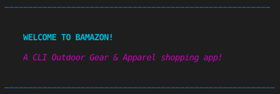

Bamazon is a shopping prototype CLI app that uses a SQL database to track orders, update inventories, and determines trending products

## Overview

The bamazon app will take in orders from customers and deplete stock from the store's inventory. Bamazon also tracks product sales across departments and generates reports of the highest-grossing departments in the store.

Make sure you save and require the MySQL and Inquirer npm packages in your homework files--your app will need them for data input and storage.

# Requirements

* Node.js
* MySQL
* Inquirer.js
* Chalk.js

## How it work

### Customer View

When you enter BAMAZON, the app will ask you if you want to view the inventory.

If you say "yes", BAMAZON will print the inventory for you!

If you want to purchase more items than there are in stock (for instance, 11 silk shirts), the app will let you know that there is insufficient inventory for your purchase.

It will then ask you if you want to buy something else! If you select an item and an amount that is in stock, BAMAZON will calculate a total price for you and update the inventory on the SQL database!

### Manager View

When managers enter the app, they are given several manager options:

* `View Products for Sale` is similar to the customer view, except it will print all items whether they are in stock or not:

    ![listAll]https://media.giphy.com/media/X6SjKGSJjCzggdV9L7/giphy.gif

* `View Low Inventory Products` will show all products that have less than 5 items in stock:

    ![lowIventory]https://media.giphy.com/media/X6SjKGSJjCzggdV9L7/giphy.gif

* `Manage Product Inventory` will allow you to update the inventory for any item. Notice that after we update the inventory for an item that was previously low stock, a special message shows up in the "View Low Inventory Products" report.

    ![manageInventory]https://media.giphy.com/media/X6SjKGSJjCzggdV9L7/giphy.gif

* `Manage Product List` allows the user to add new products to the inventory. In the manager view, you cannot add items to departments that don't exist.

    ![manageProduct]https://media.giphy.com/media/X6SjKGSJjCzggdV9L7/giphy.gif

* `Mischieve Managed` closes the connection to the database and ends the session. The user has the option to exit at several stages during the session. 

    ![goodBye]https://media.giphy.com/media/X6SjKGSJjCzggdV9L7/giphy.gif

- - -

